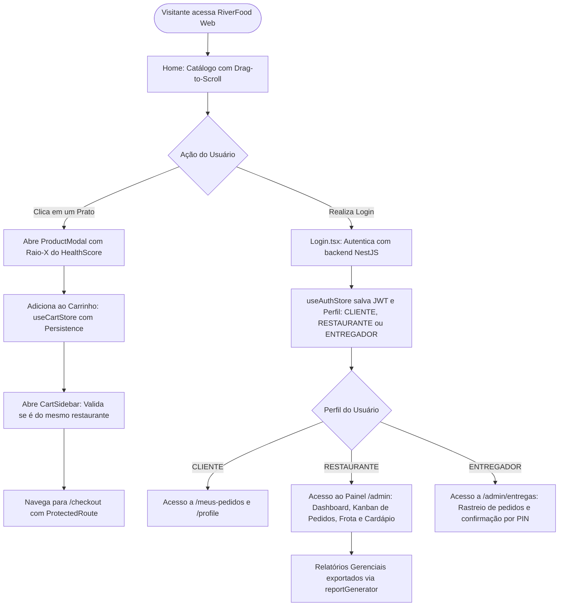
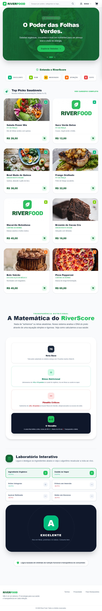
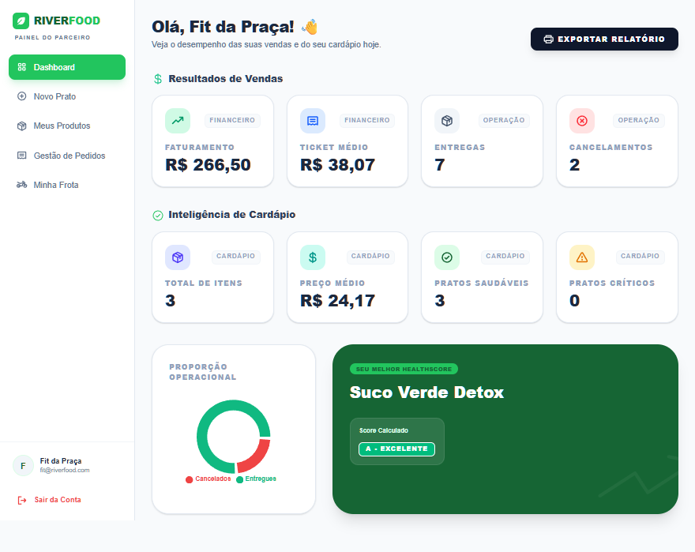
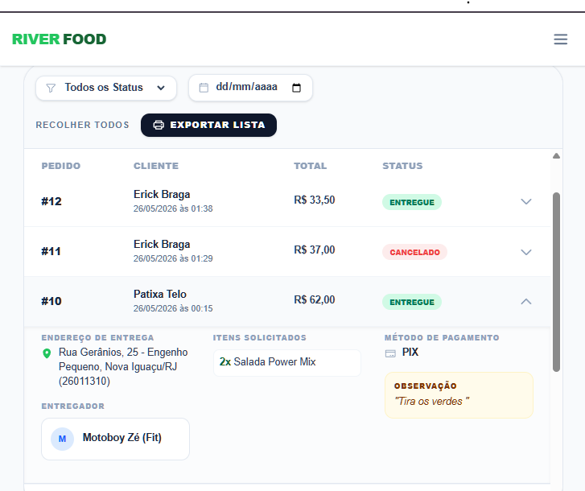

# 🌊 River Food Web - Nutrição Inteligente & Delivery

<br />

<div align="center">

[](https://riverfood-frontend.vercel.app/)
[](https://react.dev/)
[](https://www.typescriptlang.org/)
[](https://vitejs.dev/)
[](https://tailwindcss.com/)
[](https://github.com/pmndrs/zustand)
[](https://www.framer.com/motion/)
[](https://zod.dev/)
[](LICENSE)
[](#)

</div>

---

A interface web da plataforma **RiverFood** é uma solução full-stack que redefine a experiência de escolha alimentar. Através de um Motor de HealthScore exclusivo, o projeto analisa métodos de preparo para guiar o usuário rumo a uma alimentação mais consciente, enquanto entrega painéis dedicados e seguros para três perfis de usuários: Clientes, Restaurantes (Administradores) e Entregadores.

---

🔗 **Acesse a plataforma ao vivo:** [https://riverfood-frontend.vercel.app/](https://riverfood-frontend.vercel.app/)

---

## 🚀 Tecnologias Utilizadas

| Tecnologia | Categoria | Papel na Plataforma |
| :--- | :--- | :--- |
| **[React](https://react.dev/)** | Core Library | Construção da interface declarativa em componentes funcionais modernos com hooks. |
| **[TypeScript](https://www.typescriptlang.org/)** | Superset | Tipagem estática em tempo de compilação em todas as entidades, stores e schemas. |
| **[Vite](https://vitejs.dev/)** | Bundler / Build Tool | Ambiente de compilação ultrarrápido com Hot Module Replacement (HMR). |
| **[Tailwind CSS](https://tailwindcss.com/)** | Estilização | Design System responsivo baseado em classes utilitárias no padrão Neon-Dark. |
| **[Framer Motion](https://www.framer.com/motion/)** | Animação | Transições fluidas em modais, gavetas de carrinho e micro-interações de cards. |
| **[Phosphor Icons](https://phosphoricons.com/)** | Iconografia | Ícones vetoriais modernos e consistentes em toda a interface. |
| **[Zustand](https://github.com/pmndrs/zustand)** | State Management | Gerenciamento de estado global resiliente com persistência (`useCartStore`, `useAuthStore`). |
| **[Zod](https://zod.dev/)** | Validação de Dados | Validação rigorosa de esquemas para formulários de produtos e credenciais de usuários. |
| **[Axios](https://axios-http.com/)** | Cliente HTTP | Interceptação de requisições, injeção de tokens JWT e tratamento global de erros de rede. |
| **[Vercel](https://vercel.com/)** | Deploy & CI/CD | Hospedagem contínua com regras de reescrita em `vercel.json` para roteamento SPA. |

---

## 🎯 Diferenciais e Destaques Técnicos

* **Motor de HealthScore (Raio-X Nutricional):** O frontend consome um algoritmo do backend que processa atributos de saúde (como *In Natura*, *Rico em Proteínas* ou *Ultraprocessado*) para atribuir uma nota visual dinamicamente (A, B ou C) no modal de detalhes do produto.
* **UX Avançada (Drag-to-Scroll & Wheel):** Barra de categorias personalizada que adapta a experiência mobile para o desktop, contando com conversão de scroll vertical para horizontal e sistema de clique e arrasto para navegação fluida.
* **Controle de Acesso Baseado em Perfis (RBAC):** Utilização de `<ProtectedRoute />` para blindar rotas. Clientes não acessam o `/admin`, e Restaurantes possuem dashboards exclusivos para gestão de frota e controle de pedidos.
* **Gerenciamento de Estado Resiliente:** Carrinho de compras robusto controlado globalmente via `useCartStore` (Zustand). O estado sobrevive ao fechamento do navegador e valida regras restritas (como impedir a mistura de produtos de restaurantes diferentes no mesmo pedido).
* **Gestão em Tempo Real de Entregas e Pedidos:** Visão em Kanban interativo para o painel do restaurante (`Orders.tsx`) com controle de status, cancelamentos com justificativa e validação de PIN de entrega.
* **Gerador de Relatórios em Tempo Real (`reportGenerator.ts`):** Emissão de relatórios gerenciais estruturados de vendas, faturamento e desempenho da frota de entregadores.
* **Estética & Usabilidade:** Interface baseada no padrão **Neon-Dark** e **Outlined**, focada em alto contraste e legibilidade.

---

## 🛠️ Arquitetura do Projeto

### Estrutura Completa de Diretórios

```bash
riverfood-frontend/
├── doc/
│   └── img/                                   # Evidências e capturas de tela da documentação
├── public/                                    # Ativos estáticos públicos e favicon
├── src/
│   ├── App.css                                # Estilos complementares
│   ├── App.tsx                                # Configuração do React Router DOM e rotas protegidas
│   ├── index.css                              # Diretivas do Tailwind CSS e regras de scrollbar
│   ├── main.tsx                               # Ponto de entrada do React 18 (createRoot)
│   ├── components/                            # Componentes reutilizáveis e layouts
│   │   ├── AdminLayout.tsx                    # Layout com sidebar responsiva para administradores
│   │   ├── CartSidebar.tsx                    # Gaveta lateral do carrinho de compras com Zustand
│   │   ├── DefaultLayout.tsx                  # Layout padrão da área de compras do cliente
│   │   ├── Footer.tsx                         # Rodapé institucional
│   │   ├── Header.tsx                         # Barra de navegação com busca e modal de login
│   │   ├── HealthScoreSection.tsx             # Seção educativa sobre o algoritmo nutricional
│   │   ├── HeroSection.tsx                    # Banner promocional principal da página inicial
│   │   ├── OrderDetailModal.tsx               # Modal de detalhes e cancelamento de pedidos
│   │   ├── ProductCard.tsx                    # Card de produto com fallback de imagem e tags
│   │   ├── ProductModal.tsx                   # Modal com raio-X nutricional e seletor de adicionais
│   │   ├── ProtectedRoute.tsx                 # Guardião de rotas com verificação de perfil (RBAC)
│   │   ├── ServerOffline.tsx                  # Tela de aviso em caso de desconexão da API
│   │   ├── Sidebar.tsx                        # Barra lateral de navegação administrativa
│   │   └── TagHealthScore.tsx                 # Badge visual dinâmica das notas de saúde (A, B, C)
│   ├── pages/                                 # Telas e views da aplicação
│   │   ├── Checkout.tsx                       # Finalização de pedido com cálculo de taxa e endereço
│   │   ├── Home.tsx                           # Catálogo principal com filtro de categorias
│   │   ├── Login.tsx                          # Autenticação de clientes, entregadores e restaurantes
│   │   ├── MeusPedidos.tsx                    # Rastreamento de pedidos do usuário com status
│   │   ├── NotFound.tsx                       # Página 404 personalizada
│   │   ├── Profile.tsx                        # Gestão de dados pessoais do cliente
│   │   ├── RestaurantePage.tsx                # Cardápio exclusivo de um restaurante selecionado
│   │   ├── Search.tsx                         # Página de resultados de busca com múltiplos filtros
│   │   └── admin/                             # Painel de gestão do restaurante
│   │       ├── Dashboard.tsx                  # Gráficos com Recharts e métricas financeiras
│   │       ├── DeliveryView.tsx               # Monitoramento em tempo real da distribuição de entregas
│   │       ├── EditProduct.tsx                # Formulário de edição de item do cardápio com Zod
│   │       ├── Fleet.tsx                      # Gestão de cadastro e status da frota de entregadores
│   │       ├── NewProduct.tsx                 # Cadastro de novo produto com atributos de saúde
│   │       ├── Orders.tsx                     # Kanban de pedidos ativos e histórico
│   │       ├── ProductList.tsx                # Listagem e controle de disponibilidade de produtos
│   │       └── Profile.tsx                    # Dados cadastrais do restaurante
│   ├── schemas/                               # Validação de esquemas com Zod
│   │   ├── productSchema.ts                   # Validação de produtos, preços e tags de saúde
│   │   └── userSchema.ts                      # Validação de dados cadastrais e senha
│   ├── services/                              # Camada de comunicação com a API REST
│   │   └── api.ts                             # Instância do Axios com interceptores de autenticação
│   ├── store/                                 # Gerenciamento de estado global com Zustand
│   │   ├── useAuthStore.ts                    # Estado de sessão, token JWT e perfil (RBAC)
│   │   └── useCartStore.ts                    # Estado do carrinho com persistência local
│   └── utils/                                 # Funções auxiliares e helpers
│       ├── cn.ts                              # Fusão de classes Tailwind com clsx e twMerge
│       ├── healthScore.tsx                    # Mapeamento de regras de pontuação nutricional
│       └── reportGenerator.ts                 # Utilitário de exportação de relatórios gerenciais
├── eslint.config.js                           # Configuração do ESLint moderno
├── index.html                                 # Template HTML com fontes e viewport
├── package.json                               # Dependências e scripts do projeto
├── tsconfig.json                              # Configurações TypeScript base
├── vercel.json                                # Regras de reescrita para Vercel SPA
└── vite.config.ts                             # Configurações do Vite (React plugin e Recharts)
```

---

## 🔄 Fluxo de Arquitetura e Casos de Uso

O diagrama abaixo sintetiza a jornada do usuário e a interação entre o front-end, o estado Zustand e o backend:



---

## 🛡️ Auditoria de Segurança e Conectividade de Rede

* **Interceptação de Sessão com Axios:** As requisições enviadas pela camada de serviço (`src/services/api.ts`) anexam automaticamente o token JWT presente no `useAuthStore`:
  ```typescript
  api.interceptors.request.use((config) => {
    const token = useAuthStore.getState().token;
    if (token) {
      config.headers.Authorization = `Bearer ${token}`;
    }
    return config;
  });
  ```
* **Tratamento Global de Desconexão e 401:** Respostas com status `401 Unauthorized` provocam a limpeza automática da sessão e redirecionamento seguro para a página de login.
* **Componente de Resiliência (`ServerOffline.tsx`):** Em caso de indisponibilidade momentânea ou falha de conectividade com a API backend, a aplicação exibe uma interface amigável com botão de reconexão (*"Tentar novamente"*), evitando telas brancas de erro.

---

## 💻 Como Executar o Projeto Localmente

### Pré-requisitos
* [Node.js](https://nodejs.org/) versão 18 LTS ou superior instalada.
* Gerenciador de pacotes `npm` ou `yarn`.
* A API do **RiverFood Backend** em execução (localmente ou via URL em nuvem).

### Configuração de Ambiente
Crie um arquivo `.env` na raiz do projeto com base no modelo abaixo:

```env
VITE_API_URL=http://localhost:3000
```

### Comandos Disponíveis

1. **Instalação das dependências:**
   ```bash
   npm install
   ```

2. **Inicialização em modo de desenvolvimento:**
   ```bash
   npm run dev
   ```
   Acesse a aplicação em seu navegador no endereço: `http://localhost:5173`

3. **Geração de build para produção:**
   ```bash
   npm run build
   ```

4. **Verificação de linting de código:**
   ```bash
   npm run lint
   ```

---

## 📸 Telas da Aplicação

### Visão do Cliente & Motor de HealthScore
> Exploração do cardápio e análise nutricional dinâmica dos pratos.

### Página Inicial
<details>
  <summary><strong>🖥️ Ver a Página Inicial Completa (Clique AQUI para expandir)</strong></summary>

   

</details>

### Detalhe do Produto


---

### Visão do Restaurante (Painel Administrativo)
> Dashboard gerencial de vendas, saúde do cardápio e gestão de frota/pedidos.

### Dashboard Gerencial


### Histórico de Pedidos


---

## 📈 Melhorias e Próximos Passos (Roadmap)

- [ ] **WebSockets para Atualização em Tempo Real:** Conectar o Kanban de pedidos (`Orders.tsx`) e a tela de entregas (`DeliveryView.tsx`) a eventos do Socket.io para atualização instantânea sem polling.
- [ ] **Notificações Push no Navegador:** Alertar o cliente a cada mudança de status do pedido (*"Em preparo"*, *"Saiu para entrega"*, *"Entregue"*).
- [ ] **Integração com Gateway de Pagamento:** Conectar a tela de checkout a provedores como Mercado Pago ou Stripe para geração de QR Code Pix dinâmico.
- [ ] **Modo Escuro / Claro Opcional:** Adicionar alternador de tema mantendo a base Neon-Dark como padrão.
- [ ] **Suíte de Testes Automatizados:** Implementar testes unitários com Vitest e testes de ponta a ponta com Cypress ou Playwright.

---

## 🤝 Como Contribuir

1. Faça um **Fork** do repositório.
2. Crie uma branch com a sua melhoria:
   ```bash
   git checkout -b feature/minha-feature
   ```
3. Realize seus commits seguindo mensagens semânticas:
   ```bash
   git commit -m "feat: adiciona suporte a notificacoes push para status de pedidos"
   ```
4. Envie as modificações para o seu repositório remoto:
   ```bash
   git push origin feature/minha-feature
   ```
5. Abra um **Pull Request** detalhando a implementação.

---

## 👨‍💻 Desenvolvedor

Desenvolvido por **Ericky Braga**.  
Focado em transformar linhas de código em soluções de impacto para o bem-estar e negócios tecnológicos.

[LinkedIn](https://www.linkedin.com/in/erickysantana/) | [GitHub](https://github.com/erickystn)

---

## 📄 Licença

Este projeto está sob a licença **MIT**. Sinta-se à vontade para estudar, clonar e contribuir com o projeto.
